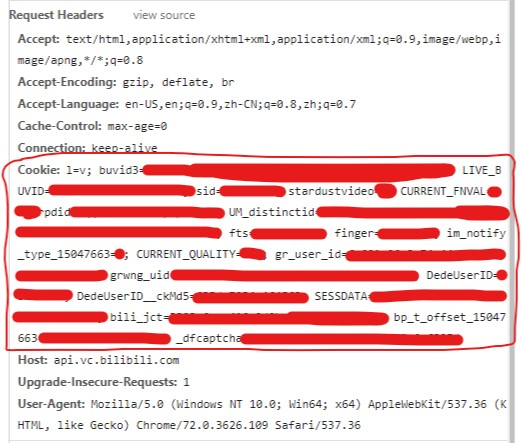

# Alpha版运行说明

本版本基于`Python3`，需安装`Python3`以及相应的模块。包括`requests`、`smtplib`、`email`等。

模块安装完成后，完成配置，直接在`Python3`中运行即可。

----

## 必要配置

主要包括两个文件中的配置：cookies与config.py。

- cookies：此文件中为登录B站后产生的`Cookie`，获取动态所必需。
- config.py：需配置其中用户信息部分，主要为邮件的发件人、收件人、邮箱服务器地址、邮箱用户与密码等。

### `cookies`文件配置

- 首先登录B站。如图：

- 访问`https://api.vc.bilibili.com/dynamic_svr/v1/dynamic_svr/dynamic_new?uid=YOUR_UID&type=8`，并取得相应`cookies`。（将此`URL`中`YOUR_UID`字段替换为你自己的`uid`）

将图中红框内的所有`cookie`全部复制到`cookies`文件中。（保证所有`cookies`在一行内）

### `config.py`文件配置

将你发送邮件的发件人、收件人、邮箱服务器地址、邮箱用户与密码填写即可。

### 时间间隔设置

在`BilibiliUP`文件中，可以通过设置`MinTime`与`MaxTime`进行动态获取的时间间隔控制。（两个变量单位均为秒）

----

## 已知问题

- `cookie`失效问题。`cookie`每过一段时间会失效，需要手动进行更新。