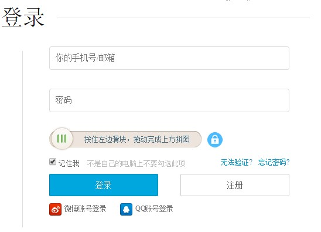
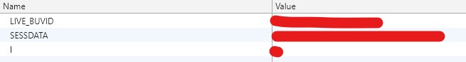

# Alpha版运行说明

本版本基于`Python3`，需安装`Python3`以及相应的模块。包括`requests`、`smtplib`、`email`等。

模块安装完成后，完成配置，直接在`Python3`中运行即可。

----

## 必要配置

配置`Config.py`文件中相应内容。包括用户邮箱账号、密码、发件人、收件人、邮箱服务器地址、用户B站UID。

- 首先登录B站。如图：

- 访问`https://api.vc.bilibili.com/dynamic_svr/v1/dynamic_svr/dynamic_new?uid=YOUR_UID&type=8`，并取得相应`cookies`。（将此`URL`中`YOUR_UID`字段替换为你自己的`uid`）

- 将图中三个`Cookie`的值对应填入文件中。

- 设置时间间隔：
通过设置`MinTime`与`MaxTime`进行动态获取的时间间隔控制。（两个变量单位均为秒）

----

## 已知问题

- `cookie`失效问题。`cookie`每过一段时间会失效，需要手动进行更新。
- 邮件中插入的图片在某些邮箱中可能无法正常显示。可以通过将图片以附件形式发送，然后再在邮件正文中进行引用的方式解决。